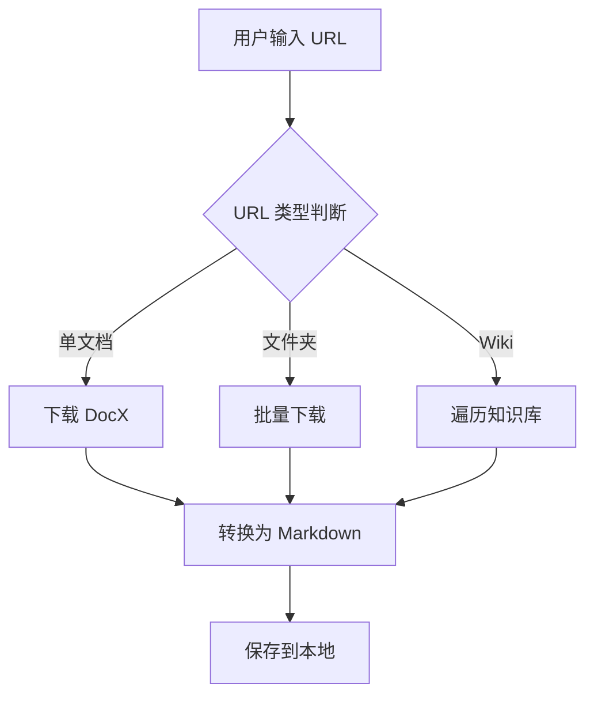
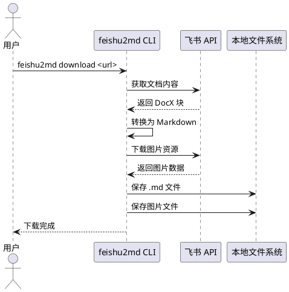

# 增量更新测试文档

本文档用于测试 upload 功能对各种 Markdown 元素的转换能力。

## 行内样式

这是一段包含 **粗体**、*斜体*、~~删除线~~、`行内代码` 和 ***粗斜体*** 的文本。

## 链接与图片

这是一个 [飞书开放平台](https://open.feishu.cn/) 的链接。


### 三级标题

这是三级标题下的段落。

#### 四级标题

这是四级标题下的段落。

## 列表

### 无序列表

- 第一项
- 第二项
  - 嵌套第一项
  - 嵌套第二项
- 第三项

### 有序列表

1. 步骤一：配置应用凭证
2. 步骤二：OAuth 登录
3. 步骤三：下载文档
   1. 支持单文档下载
   2. 支持批量文件夹下载
   3. 支持 Wiki 下载

### 任务列表

- [x] 实现基础下载功能
- [x] 支持 DocX 转 Markdown
- [ ] 支持上传 Markdown 到飞书
- [ ] 支持增量更新

## 代码块

Go 示例：

```go
func main() {
	client := core.NewClient(appID, appSecret)
	doc, err := client.GetDocxDocument(docToken)
	if err != nil {
		log.Fatal(err)
	}
	fmt.Println(doc.Title)
}
```

Python 示例：

```python
import requests

def download_doc(token: str) -> dict:
    url = f"https://open.feishu.cn/open-apis/docx/v1/documents/{token}"
    resp = requests.get(url, headers={"Authorization": f"Bearer {token}"})
    return resp.json()
```

JSON 配置示例：

```json
{
  "appId": "cli_xxxx",
  "appSecret": "xxxx",
  "output": "./downloads"
}
```

## 表格

| 功能 | 状态 | 说明 |
|:-----|:----:|-----:|
| 单文档下载 | 已完成 | 支持 DocX 格式 |
| 文件夹批量下载 | 已完成 | 无限制并发 |
| Wiki 下载 | 已完成 | 信号量限制 10 并发 |
| 上传到飞书 | 开发中 | 支持增量更新 |

## 引用

> 黄河之水天上来，奔流到海不复回。

> 嵌套引用示例：
>
> > 君不见，高堂明镜悲白发，朝如青丝暮成雪。

## 分隔线

---

## 数学公式

行内公式：$E = mc^2$

块级公式：

$$
\sum_{i=1}^{n} i = \frac{n(n+1)}{2}
$$

## Callout（告示块）

> [!NOTE]
> 这是一个说明提示，用于提供补充信息。飞书对应蓝色高亮块。

> [!WARNING]
> 这是一个警告提示，提醒用户注意潜在风险。飞书对应橙色高亮块。

> [!TIP]
> 这是一个技巧提示，分享实用的小窍门。飞书对应绿色高亮块。

## 折叠（可折叠内容）

<details>
<summary>点击展开：feishu2md 支持的文档类型</summary>

- DocX（新版文档）
- Wiki（知识库文档）
- 电子表格（导出为 CSV）
- 多维表格（导出为 CSV）
- 白板（导出为图片）

</details>

<details>
<summary>点击展开：配置文件示例</summary>

```json
{
  "appId": "cli_xxxx",
  "appSecret": "xxxx",
  "output": "./downloads"
}
```

</details>

## HTML 内容

按下 <kbd>Ctrl</kbd> + <kbd>C</kbd> 可以复制文本。

水的化学式是 H<sub>2</sub>O，爱因斯坦质能方程 E = mc<sup>2</sup>。

这段文本中有 <mark>高亮标记</mark> 的部分，用于强调重点内容。

### HTML 块

<div style="border: 1px solid #e0e0e0; padding: 16px; border-radius: 8px; background-color: #fafafa;">
  <h3>项目概览面板</h3>
  <p>以下是 <strong>feishu2md</strong> 项目的功能矩阵和配置说明。</p>

  <table border="1" cellpadding="8" cellspacing="0" style="border-collapse: collapse; width: 100%;">
    <thead>
      <tr style="background-color: #f0f0f0;">
        <th>模块</th>
        <th>功能</th>
        <th>状态</th>
        <th>备注</th>
      </tr>
    </thead>
    <tbody>
      <tr>
        <td rowspan="3">下载</td>
        <td>单文档下载</td>
        <td>✅ 已完成</td>
        <td>支持 DocX 格式</td>
      </tr>
      <tr>
        <td>文件夹批量下载</td>
        <td>✅ 已完成</td>
        <td>无限制并发</td>
      </tr>
      <tr>
        <td>Wiki 知识库下载</td>
        <td>✅ 已完成</td>
        <td>信号量限制 10 并发</td>
      </tr>
      <tr>
        <td colspan="2">上传到飞书</td>
        <td>🚧 开发中</td>
        <td>支持增量更新、图片上传</td>
      </tr>
    </tbody>
  </table>

  <dl>
    <dt><strong>认证方式</strong></dt>
    <dd>支持 <code>tenant_access_token</code>（应用级）和 <code>user_access_token</code>（用户级）两种认证方式。</dd>
    <dt><strong>限流策略</strong></dt>
    <dd>API 调用限制为 4 req/s，超时时间 60 秒。Wiki 下载并发上限为 10。</dd>
    <dt><strong>缓存机制</strong></dt>
    <dd>白板图片缓存于 <code>~/.cache/feishu2md/whiteboards/</code>，使用 <code>obj_edit_time</code> 作为版本标识。</dd>
  </dl>

  <div style="margin-top: 12px; padding: 12px; background-color: #fff3cd; border-left: 4px solid #ffc107;">
    <strong>注意：</strong>配置表单仅作展示用途，实际配置请使用 <code>feishu2md config</code> 命令。
    <form style="margin-top: 8px;">
      <div style="margin-bottom: 8px;">
        <label for="appId">App ID：</label>
        <input type="text" id="appId" name="appId" placeholder="cli_xxxx" style="padding: 4px 8px;">
      </div>
      <div style="margin-bottom: 8px;">
        <label for="appSecret">App Secret：</label>
        <input type="password" id="appSecret" name="appSecret" placeholder="请输入密钥" style="padding: 4px 8px;">
      </div>
      <div style="margin-bottom: 8px;">
        <label for="output">输出格式：</label>
        <select id="output" name="output" style="padding: 4px 8px;">
          <option value="markdown">Markdown</option>
          <option value="json">JSON</option>
          <option value="html">HTML</option>
        </select>
      </div>
      <div style="margin-bottom: 8px;">
        <label for="notes">附加说明：</label><br>
        <textarea id="notes" name="notes" rows="3" cols="40" placeholder="可选的附加说明..."></textarea>
      </div>
    </form>
  </div>

  <div style="margin-top: 12px;">
    <h4>嵌套结构示例</h4>
    <div style="padding: 8px; border: 1px dashed #ccc;">
      <p>外层容器</p>
      <div style="padding: 8px; margin-left: 16px; border: 1px dotted #999;">
        <p>内层容器，包含一个列表嵌套表格：</p>
        <ul>
          <li>第一项：纯文本</li>
          <li>第二项：包含子表格
            <table border="1" cellpadding="4" cellspacing="0" style="border-collapse: collapse; margin-top: 4px;">
              <tr><th>Key</th><th>Value</th></tr>
              <tr><td>appId</td><td>cli_xxxx</td></tr>
              <tr><td>appSecret</td><td>******</td></tr>
            </table>
          </li>
          <li>第三项：包含 <em>斜体</em> 和 <strong>粗体</strong> 的混合内容</li>
        </ul>
      </div>
    </div>
  </div>
</div>

## Mermaid 图表



## PlantUML 图表



## 结语

以上内容覆盖了常见的 Markdown 元素，用于验证 upload 命令的转换正确性。
<!--
source: https://feishu.cn/wiki/Ryl2wUerhi0xBxkdeNIclN9Rneh
-->
