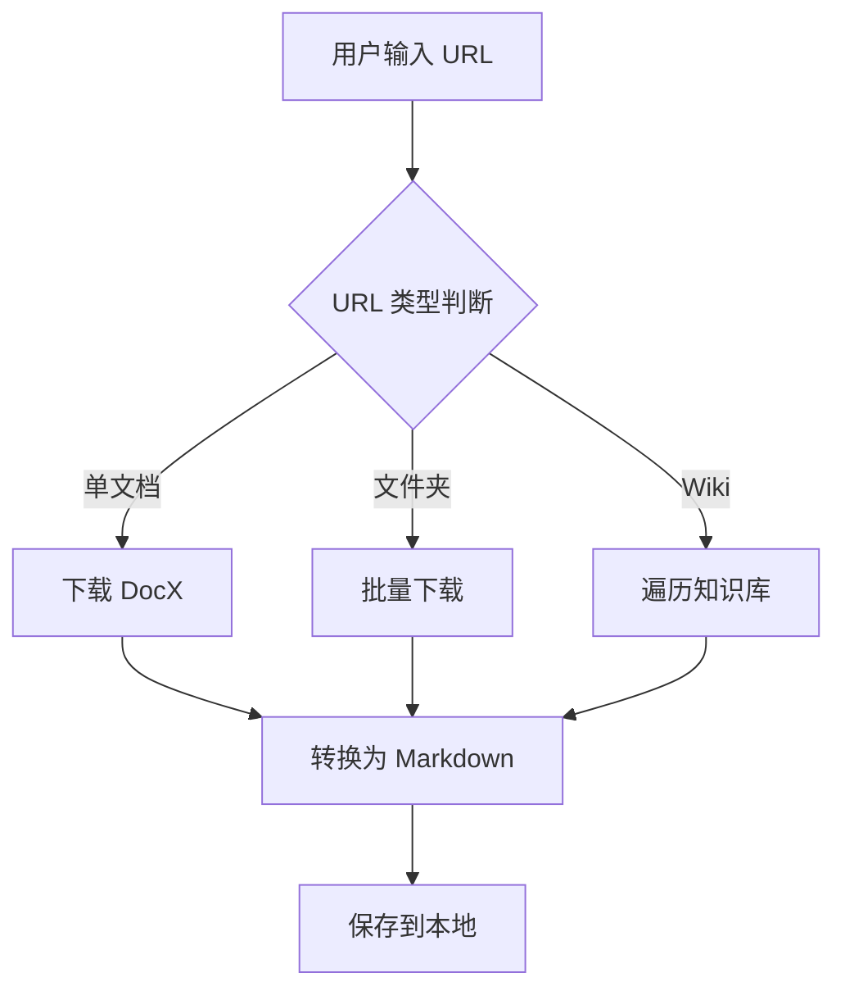

```mermaid
graph TD
    A[用户输入 URL] --> B{URL 类型判断}
    B -->|单文档| C[下载 DocX]
    B -->|文件夹| D[批量下载]
    B -->|Wiki| E[遍历知识库]
    C --> F[转换为 Markdown]
    D --> F
    E --> F
    F --> G[保存到本地]
```
<!--
source: https://example.feishu.cn/wiki/OC4HwIuOhia2DRkdGZIcYukbnCg
-->
