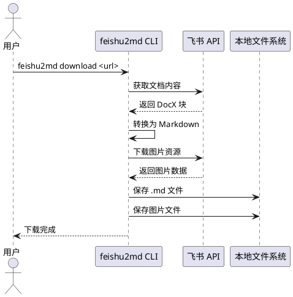

```plantuml
@startuml
actor 用户
participant "feishu2md CLI" as CLI
participant "飞书 API" as API
participant "本地文件系统" as FS

用户 -> CLI: feishu2md download <url>
CLI -> API: 获取文档内容
API --> CLI: 返回 DocX 块
CLI -> CLI: 转换为 Markdown
CLI -> API: 下载图片资源
API --> CLI: 返回图片数据
CLI -> FS: 保存 .md 文件
CLI -> FS: 保存图片文件
CLI --> 用户: 下载完成
@enduml
```
<!--
source: https://feishu.cn/wiki/CsGSw66QcixQJIk1vc3cYECLnQd
-->
